# Considerações iniciais
O foco do estudo é apenas nas atividades selecionadas, nada em relação às cores empregadas, uma vez que as cores são colocadas após a execução do algoritmo de descoberta, obtendo o tempo de permanência ou aplicando o mesmo algoritmo utilizando o tempo em vez da frequência.

# JuMP DFG

Possui as seguintes características:
- max_edges: O número absoluto máximo de conexões entre atividades (100)
- keep_events: Lista de atividades que devem ser mantidas ([])
- remove_events: Lista de atividades que devem ser removidas ([])
- trim_percentage: Proporção do início e fim para com o total de cada caso, exemplo, se 0.1 então 10% das atividades de um caso significam início, e outros 10% significam o fim, assim o meio são os 80% que faltam (0.1)

> Em média o algoritmo demora 0.00:00.03 para executar.

## Sem limite de conexões:
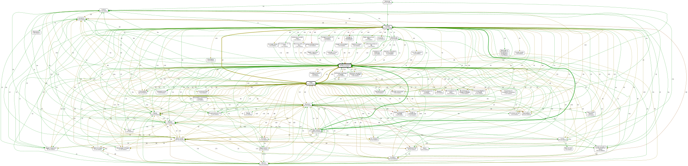

## Com o limite de conexões padrão:
Limite de conexões em 100.

## Com o limite de conexões pequeno:
Limite de conexões em 25.

## Com 40% de atividades no início e fim:
Com o max_edges em 25 e trim_percentage em 0.2.
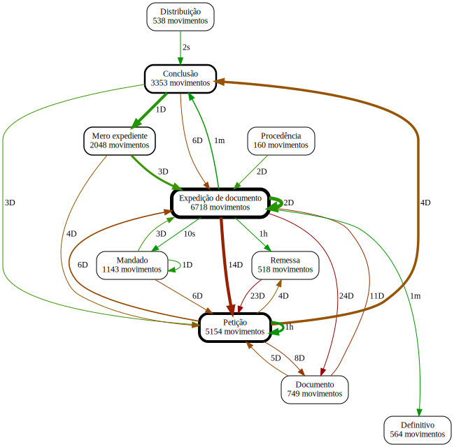

## Adicionando e removendo atividades:
Com o max_edges em 25 e fixando a atividade "Recurso", removendo a atividade "Expedição de documento" e fixando/removendo as atividades descritas.

    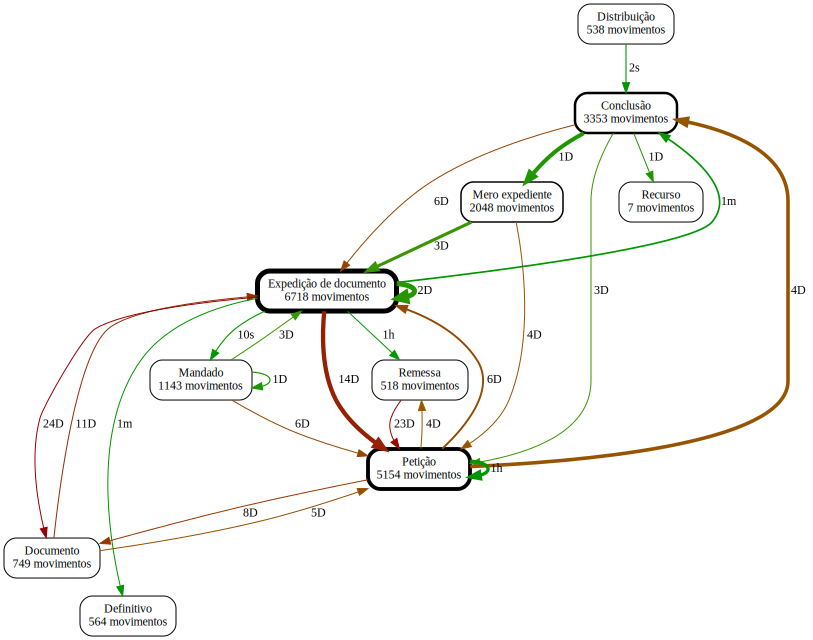
    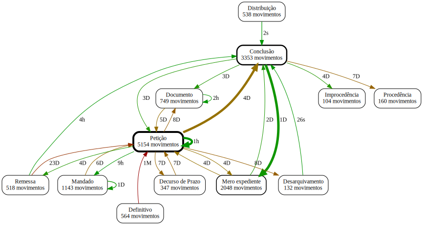
    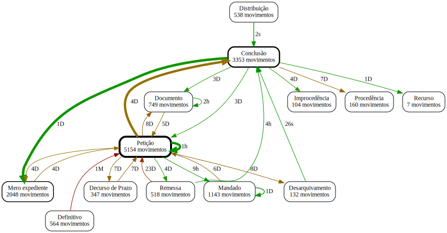

## Modificando o trim_percentage:
Com o max_edges em 10 e trim_percentage em 0, 0.05, 0.1 e 0.5 respectivamente.

    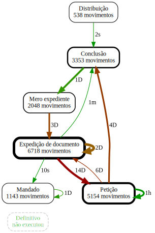
    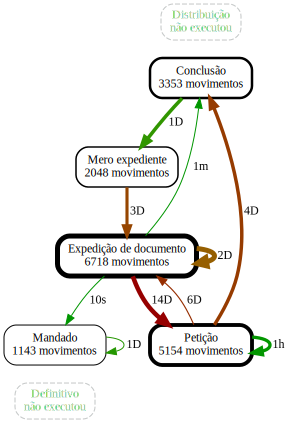
    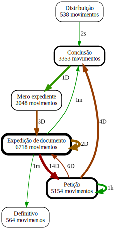
    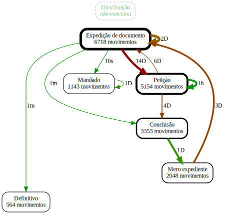

# PM4PY DFG

O algoritmo não possui parâmetros, além da indicação dos campos de caso, atividade e timestamp. Ele devolve o DFG e uma lista de atividades de início e fim.

> Em média o algoritmo demora 0.00:00.02 para executar.

# Heuristics Miner

Possui as seguintes características:
- dependency_threshold: (0.5)
- and_threshold: (0.65)
- loop_two_threshold: (0.5)
- min_act_count: Filtra as atividades pela frequência mínima (1)
- min_dfg_occurrences: Filtra as relações pela frequência mínima (1)

Demorou 0:00:00.13 para executar o algoritmo com threshold padrão, e pode chegar a quadruplicar o tempo removendo os thresholds.
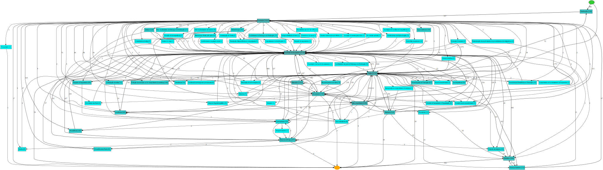

### Com thresholds em 0.8
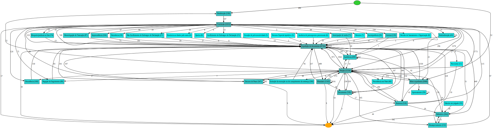

### Sem thresholds
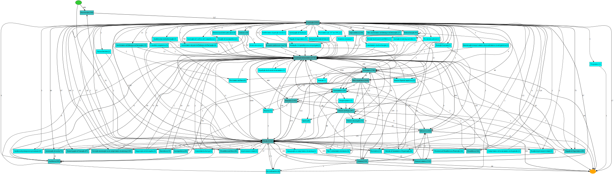

### Com min_act_count em 500
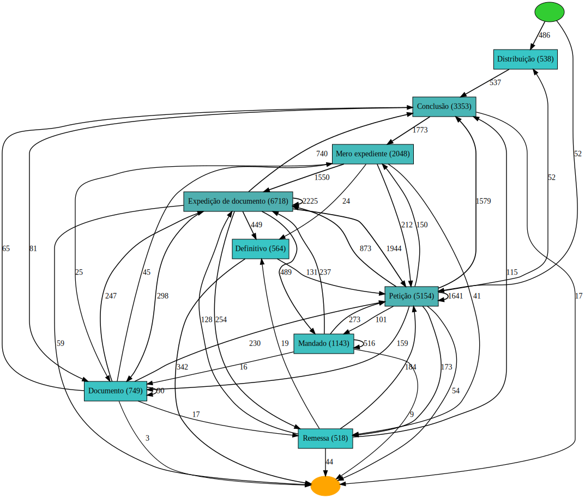

### Com min_dfg_occurrences em 500
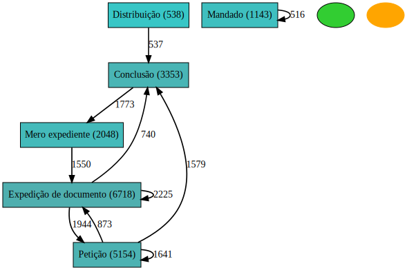

# Inductive Miner

Possui as seguintes características:
- noise_threshold: Filtra o DFG pelo número máximo de saídas (0)
- multi_processing: Utiliza multiprocessamento (False)

## discover_process_tree_inductive

Demorou pelo menos 2:20min para executar o algoritmo, sem a utilização do multiprocessamento, e 1:15min utilizando o multiprocessamento.
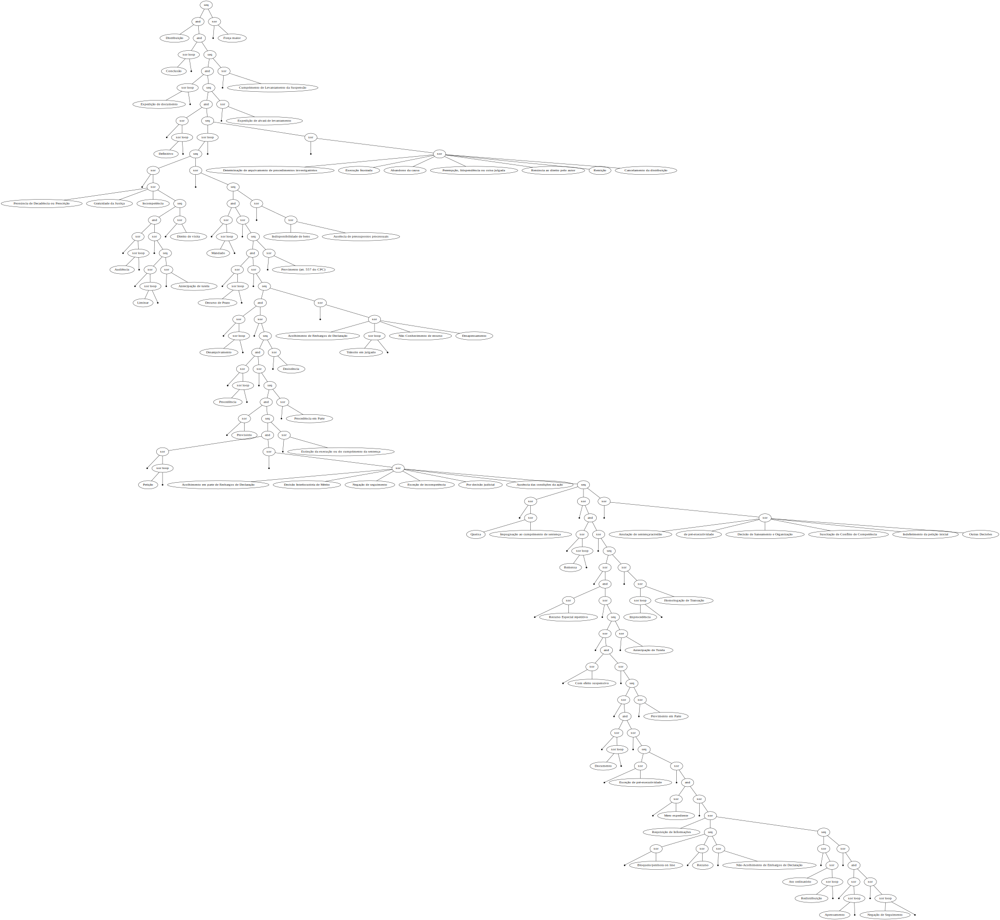

### Inductive tree com o noise_threshold em 0.5.
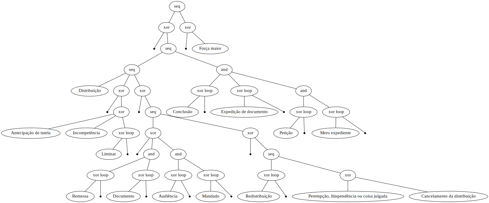

## discover_petri_net_inductive

Utilizar o multiprocessamento pode ocasionar vários `memory allocation of 64 bytes failed`.
Demorou pelo menos 1:40min para executar o algoritmo sem a utilização do multiprocessamento.

### Inductive petri net com o noise_threshold em 0.5.
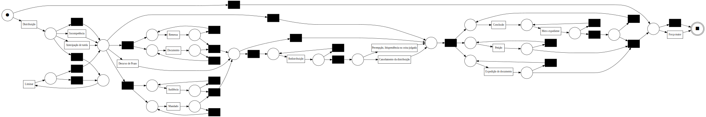